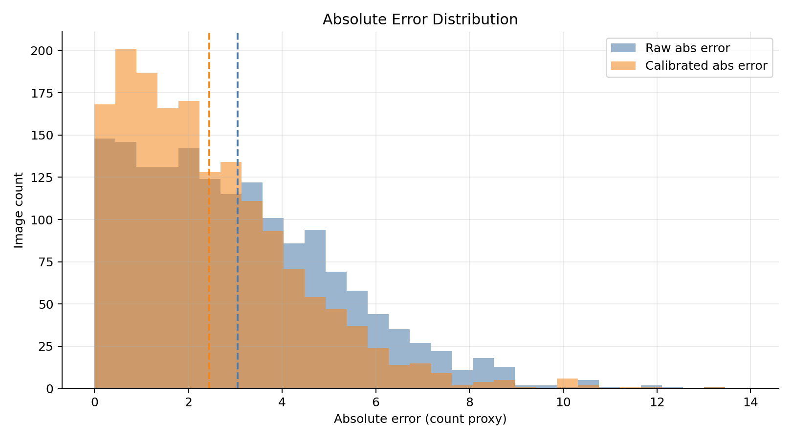
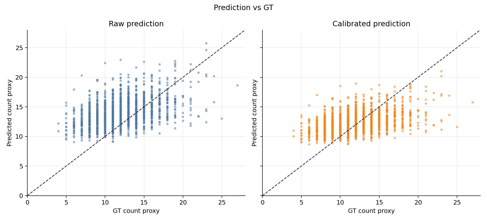
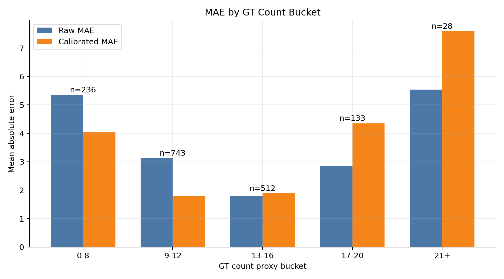
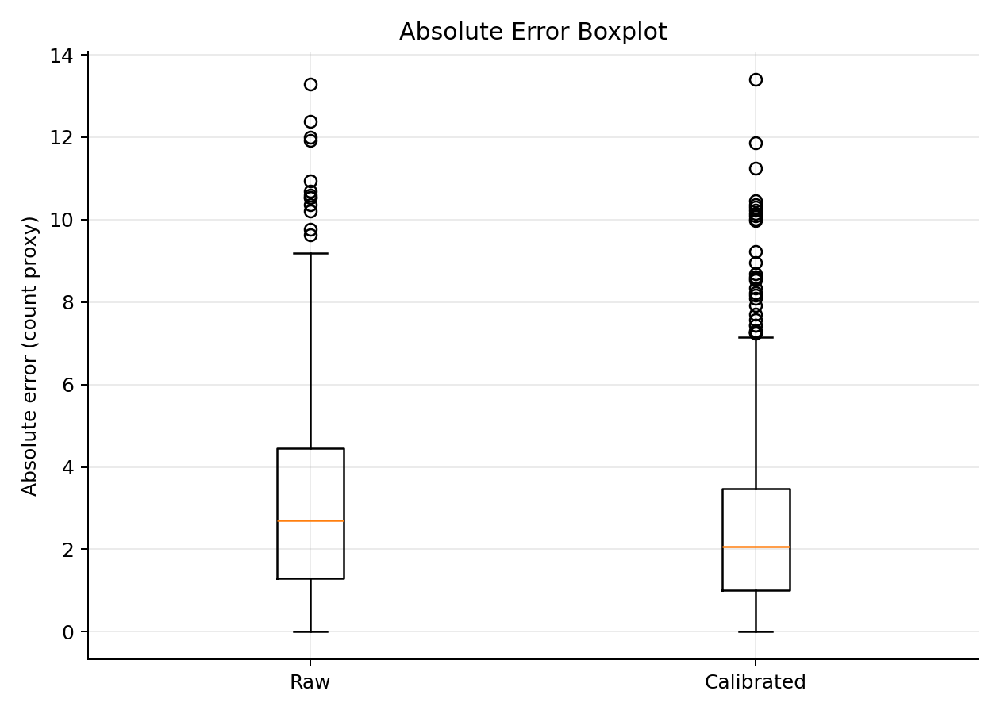
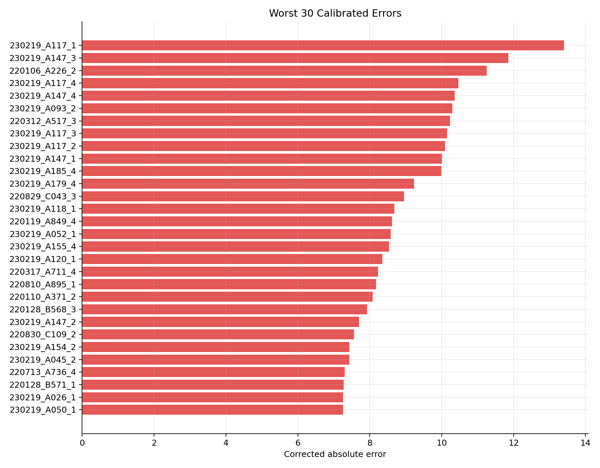

# FDU 全量整图推理结果分析

本文档用于汇报当前最佳模型 `docx5_3_e2_lambda03` 在 FDU 全部 1652 张图片上的滑窗整图推理结果。当前结果只表示基于 FDU bbox 中心点的毛囊/标注目标计数 proxy，不代表真实业务 `根/cm^2` 精度。

## 当前结论

在没有新增训练集、更高质量标注或更接近目标业务场景数据的情况下，模型继续大幅优化会比较困难。目前已经完成的 sigma、计数损失权重、预训练、冻结 frontend、滑窗对齐裁剪训练等消融实验，带来的提升都比较有限，说明主要瓶颈已经不只是单个超参数。

当前最佳模型是 `docx5_3_e2_lambda03`：CSRNet baseline、排除 `abnormal` 类别、`lambda_count=0.3`。它在 crop 级 test 上的 MAE 最低，但在 1280 x 1024 整图滑窗推理时仍存在明显误差。全量 FDU 图片校准后 MAE 从 3.0539 降到 2.4505，RMSE 从 3.7508 降到 3.0819；校准改善了整体均值误差，但对高计数图片会加重低估。

模型主要误差模式是向中等计数回归：低 GT 图片容易被高估，高 GT 图片容易被低估。尤其是 GT >= 17 的样本，校准后误差反而变大，说明单一线性校准不能同时照顾低计数和高计数区间。

## 工作进度

已完成：

- FDU VOC XML 解析、bbox 坐标修正和无效框过滤。
- 基于 bbox 中心点的高斯密度图构造。
- Dataset/DataLoader、CSRNet baseline、训练、评估、单图推理和可视化闭环。
- 阶段八消融实验：自适应 sigma、不同计数损失权重、预训练全量微调、冻结 frontend、滑窗对齐裁剪训练。
- 滑窗整图推理、拼接热力图、批量推理和 val 线性校准。
- 对 FDU 全部 1652 张图片生成整图滑窗预测 CSV，并完成误差统计和汇报图生成。

暂缓：

- DM-Count 等更复杂方法。当前 FDU 数据量和标注形式有限，直接引入更复杂模型不一定能稳定提升，建议先补数据或补标注策略。
- 真实 `MAE/cm^2` 指标。当前缺少可可靠换算到真实面积的业务标定链路，因此仍应报告计数 proxy 的 MAE/RMSE。

## 全量推理指标

预测文件归档位置：

`outputs/ablations/docx5_3_e2_lambda03/predictions/sliding_all/all_sliding_predictions.csv`

| Metric | Raw | Calibrated |
|---|---:|---:|
| n | 1652 | 1652 |
| MAE | 3.0539 | 2.4505 |
| RMSE | 3.7508 | 3.0819 |
| Median AE | 2.7051 | 2.0718 |
| P75 AE | 4.4635 | 3.4734 |
| P90 AE | 6.0194 | 4.9628 |
| P95 AE | 7.1171 | 5.8556 |
| Max AE | 13.2946 | 13.4053 |

## 分计数区间误差

| GT bucket | n | Raw MAE | Calibrated MAE |
|---|---:|---:|---:|
| 0-8 | 236 | 5.3580 | 4.0589 |
| 9-12 | 743 | 3.1405 | 1.7898 |
| 13-16 | 512 | 1.7857 | 1.8917 |
| 17-20 | 133 | 2.8411 | 4.3534 |
| 21+ | 28 | 5.5393 | 7.6030 |

这个分桶结果说明：校准主要改善了低到中等计数区间，尤其是 9-12 区间；但 17 以上高计数样本被明显低估，校准后误差更大。

## 汇报图

### 误差分布

### 预测值与 GT 对比

### 分计数区间 MAE

### 误差箱线图

### 校准后误差最大的样本

## 后续优化建议

优先级最高的是补充数据和标注，而不是继续堆叠模型结构。建议新增或增强以下数据：

- 高计数样本，尤其是 GT >= 17 的图片。
- 低计数但模型容易误判为高计数的图片。
- 与目标业务采集设备、光照、皮肤状态、发根形态更接近的数据。
- 更明确的点标注或毛囊中心标注，降低从 bbox 中心点生成 proxy 密度图带来的噪声。

如果暂时没有新数据，可以继续做较小幅度的工程优化，例如分段校准、按 GT/预测区间的误差诊断、难例重采样、对高计数样本加权训练。但这些方案更可能是小幅修正，很难从根本上突破当前误差上限。
